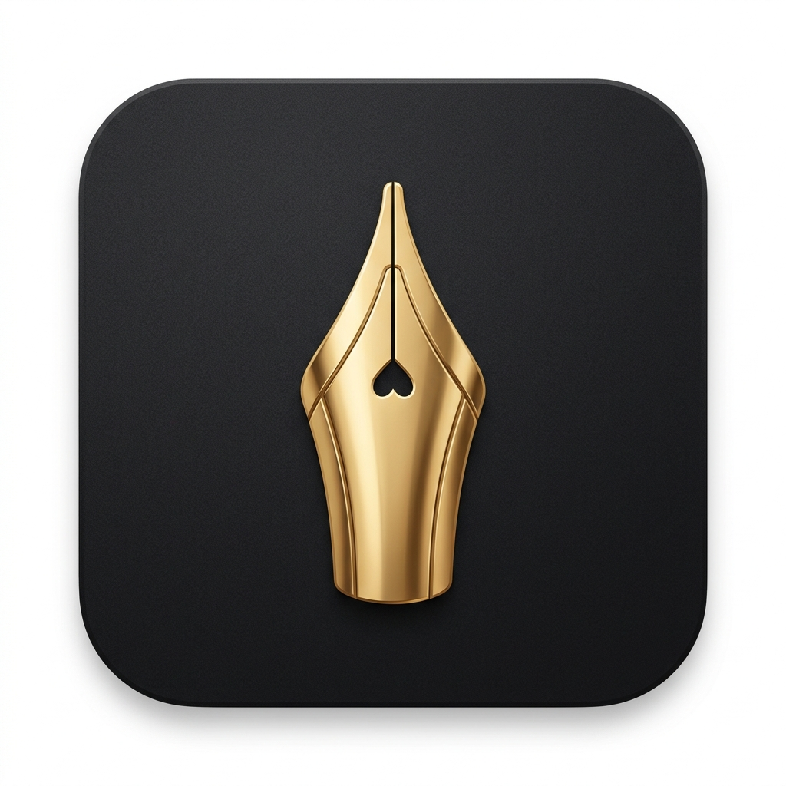

# Inkwell — Stationery for the Digital Age



**Inkwell** is a premium, minimalist browser extension designed to transform digital note-taking into an artisan experience. Inspired by high-end physical stationery, Inkwell provides a focused, tactile, and aesthetically pleasing workspace for your thoughts, checklists, and inspirations.

---

## ✨ Key Features

- **Luxury Aesthetics**: A "Digital Heirloom" design language featuring glassmorphism, smooth animations, and premium typography.
- **Tactile Physics**: Interactive binder rings and a "lifting" paper sheet that responds to your focus.
- **Dynamic Stationery**: Switch between **Ruled**, **Grid**, and **Plain** paper styles to suit your mood or task.
- **Artisan Ink**: Choose from curated ink colors like *Midnight Black*, *Royal Blue*, and *Vintage Sepia*.
- **Seamless Continuity**: Real-time auto-save ensures your thoughts are never lost.
- **Focused Writing**: A minimalist sidebar that gets out of your way, with a large, distraction-free writing area.
- **Archival History**: A beautiful gallery view of your past notes with real-time search.

---

## ⌨️ Keyboard Mastery (Power User Workflow)

Work faster without ever taking your hands off the keyboard:

| Shortcut | Action |
| :--- | :--- |
| **`Ctrl + N`** | Create a New Note |
| **`Ctrl + L`** | Toggle Archive (List) |
| **`Ctrl + P`** | Open Preferences |
| **`Ctrl + S`** | Trigger Manual Save |
| **`Esc`** | Close All Menus / Return to Editor |

---

## 🛠️ Tech Stack

Built with modern web standards for speed and reliability:
- **Core**: Vanilla JavaScript (ES6+) with a modular architecture.
- **UI**: High-performance CSS3 with Custom Properties (Variables).
- **Icons**: [Lucide Icons](https://lucide.dev/) for a clean, consistent look.
- **Storage**: Chrome/Edge Local Storage API for secure, device-local persistence.
- **Manifest**: V3 (The latest extension standard for security and performance).

---

## 📁 Project Structure

```text
inkwell/
├── icons/            # Store-ready high-resolution assets (.jpg)
├── lucide.min.js     # Lightweight icon library
├── manifest.json     # Extension configuration & permissions
├── popup.css         # Master design system & tactile animations
├── popup.html        # Semantic, accessible UI structure
├── popup.js          # Modular application logic (v2.1)
└── README.md         # This documentation
```

---

## 🚀 Installation & Development

### For Users:
1.  Download or clone this repository.
2.  Open Chrome or Edge and navigate to `chrome://extensions` or `edge://extensions`.
3.  Enable **"Developer mode"** (top right).
4.  Click **"Load unpacked"** and select the `inkwell/` folder.

### For Developers:
Inkwell is built without complex build tools to ensure maximum performance and zero dependency bloat. Simply edit the `js` or `css` files and reload the extension to see changes instantly.

---

## 📜 Privacy Statement

Inkwell is private by design. 
- **Zero Tracking**: No analytics, no cookies, no external tracking.
- **Local Storage**: Your notes never leave your machine. All data is stored locally in your browser's secure storage.
- **No Cloud**: We do not have servers. Your data is yours.

---

## ⚖️ License

Copyright © 2026. All rights reserved. 
Designed for those who appreciate the fine art of writing.
